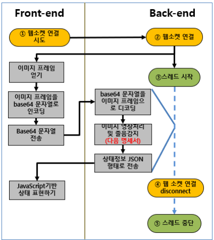
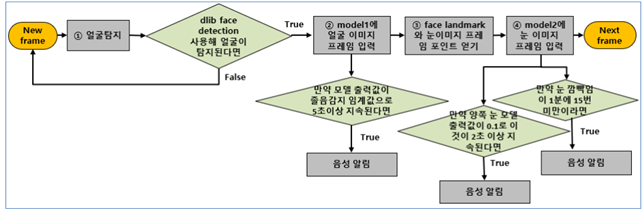

# 딥러닝 모델을 이용한 졸음 감지 서비스
**딥러닝 모델을 이용한 졸음 감지 서비스와 함께 눈 건강 보호, 일정 관리 등의 부가 서비스를 제공하는 프로젝트**

공모전: 2021 한이음 제출

소요시간: 2021.04 ~ 2021.11

팀원 수: 5

# 구성원 및 역할분담

|**이름**|**담당업무**|
|---|---|
|최영환|풀스택, 프로젝트 총괄 / 팀장|
|이지상|프론트엔드 / 프론트엔드장|
|정영도|프론트엔드|
|이현수|풀스택 / 백엔드장|
|오수지|백엔드|

# 개발 환경 및 사용 라이브러리

- **OS** : Window 10
- **Language** : Python 3.8, HTML5, JavaScript, CSS
- **Framework** : Django
- **DBMS** : MySQL
- **Library** : Python Channels, Web Socket, OpenCV, imutils, dlib
- **AI** : CNN, TensorFlow2, Kaggle
- **Cloud** : AWS EC2

# 구성도

# 역할

- 장고 프레임워크를 이용한 웹서버 개발
- 졸음감지, 눈깜빡임 횟수 측정 알고리즘 개발
- websocket을 이용해서 웹캠 영상 이미지 프레임을 서버로 전송
- 딥러닝 모델 데이터 크롤링 및 훈련
- 딥러닝 모델 서버에 적용
- 마이페이지 chart js를 이용해 통계 서비스 개발

# 알고리즘

# 데이터베이스
---

- auth_user : 사용자 정보 저장
- drowsiness_data : 졸음감지 기록 저장
- blink_data : 눈깜빡임 기록 저장
- todo_list : to do list 저장
- complete_list : 완료한 to do list 저장
- freeboard : 자유게시판 게시글 저장
- questionboard : 질문게시판 게시글 저장
- comment_questionboard : 질문게시판 답변글 저장

# 기능

### **기능 - 졸음감지, 눈깜빡임감지, To Do List**

---

webSocket을 이용해 서버로 웹캠 이미지 프레임을 보내고, 서버에서는 딥러닝 모델을 기반으로 졸음감지 알고리즘을 이용해 졸음을 감지하고 졸음감지 시 음성 알림을 합니다.

눈깜빡임은 딥러닝 모델을 이용해 1분동안 깜빡임 권장횟수 15회 미만일 경우 음성 알림을 합니다.

Ajax통신을 이용해 얼굴감지, 졸음알림, 눈깜빡임 알림 시 시각적으로 표현합니다.

시계, stop watch, to-do list를 한 화면에서 이용할 수 있습니다.

### **기능 - 마이페이지 통계**

---

마이페이지에서는 졸음통계, 눈깜빡임 통계를 그래프 형태로 제공합니다. 날짜를 선택하고 통계확인 버튼을 클릭하면 Ajax 통신을 통해 서버로부터 json 형태로 데이터를 불러와 chart js를 이용해 통계를 시각화합니다.

왼쪽 그래프는 선택한 날짜 기준 +7일의 탐지수 데이터를 보여주고, 오른쪽 파이 그래프는 졸음 혹은 눈깜빡임 경고를 탐지한 시간을 기준으로 시간별로 그래프를 표시합니다.

### **기능 - 랭킹게시판**

---

to-do list에 등록한 일을 가장 많이 수행한 퍼센트 순위로 사용자간 순위를 확인할 수 있습니다.

### **기능 - Q&A, 자유 게시판**

---

Q&A 게시판을 통해 개발자와 소통할 수 있습니다.

자유게시판을 통해 사용자간 소통할 수 있습니다.
